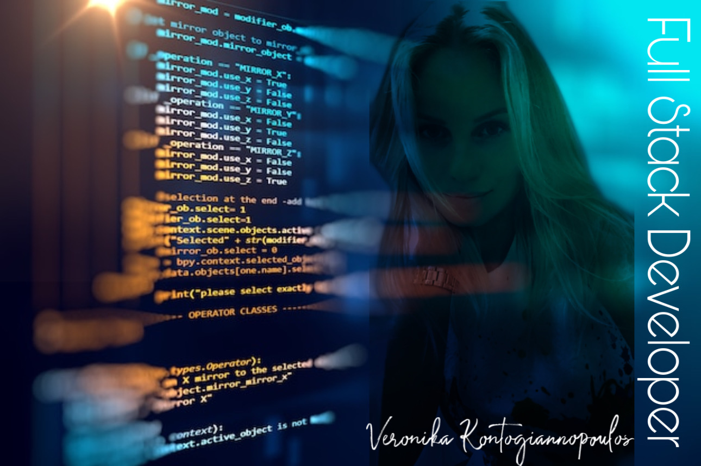

## Hi, I am Veronika and I am FULL STRACK DEVELOPER. I have a UPWORK account and work with senior developers with over decades of experience. If you need anything and looking for professionals who can do the job on time and the way you want, send me a message. 

# ABOUT ME:  

#### I'm a Full-Stack Developer passionate about programming and coding, creating technology to elevate people, sharing ideas, and building community.  My favorite technologies I have been working with include Python, JavaScript, Java, SQL, HTML5, CSS and Kubernetes
#### I am ready and excited to excel my skills to the next level with knowledge and experiences with frameworks and libraries such as  
- Django, Flask, NodeJS, ReactJS, ExpressJS, MongooseJS, Spring Boot, Hibernate, AngularJS, Typescript, jQuery, Bootstrap
- Databases MySQL, MongoDB

### Fun facts:

- I love traveling, visiting countries, exploring cities, and learning about their cultures.
- I am an animal lover! My favorite animal is a cat. ( I own two  beautiful Maine-Coons ♡)

<!--
**veronikakontos/veronikakontos** is a ✨ _special_ ✨ repository because its `README.md` (this file) appears on your GitHub profile.

## I'm a full-stack Developer who is truly passionate about making open-source accessible, creating technology to elevate people, share ideas and building commmunity. My favorites technologies/languages I have been working with include ReactJS, MySql, Flask, MongoDb, Spring... I am ready and excited to excel my skills to the next level with knowledge and experiences with HTML5,CSS, Python, Java, MERN (mongo, express,react, node.js) and more libraries and frame-works such as STS, MongoDB, Mongoose, Bootstrap, JSP, DOM, AWS, Oracle SQL, Postman.

  

